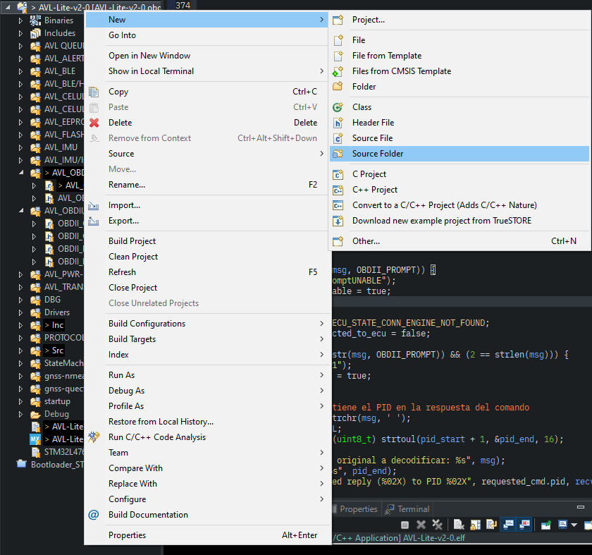

# DBG

Librería para mandar mensajes de depuración por el puerto serial del microcontrolador.

# ¿Como funciona?

La librería redefine la funcion `_putchar` enviando por la UART el caracter recibido,
con esto todas las llamadas a `printf` llaman a nuestro `_putchar`.

Si necesitas portar la librería a microcontroladores que no sean de ST, solo cambia
el contenido de `_putchar` con la funcion que se encarga de enviar caracteres por el serial.

# ¿Como utilizar la libreria?

1. Clona este repositorio en tu proyecto:
```
git clone --recurse-submodules https://github.com/C47D/dbg.git
```

2. Entra al directorio `dbg` y actualiza los submodulos
```
cd dbg
git submodule update --init --recursive
```

## Agregar como submodulo

Para agregar la librería como submodulo (estando en la raiz de tu directorio):
```
$ git submodule add https://github.com/C47D/dbg.git
$ cd dbg
$ git submodule init
$ git submodule update
```
Estos ultimos comandos son para actualizar la librería [printf](https://github.com/mpaland/printf).

2. Agrega las carpetas `DBG`, `hexdump` y `printf` al path de busqueda de tu proyecto.
3. Clic derecho en la carpeta del directorio, selecciona New y luego Source Folder.



4. Incluye `DBG.h` donde vayas a utilizar las funciones de la libreria.
5. Abre `DBG.h` y asigna el handler de la UART a utilizar al simbolo DBG_UART_PORT, por ejemplo:
```
#define DBG_UART_PORT	huart1
```
